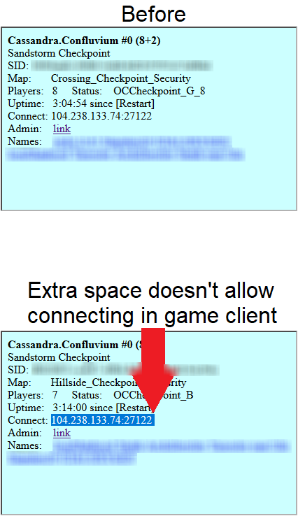
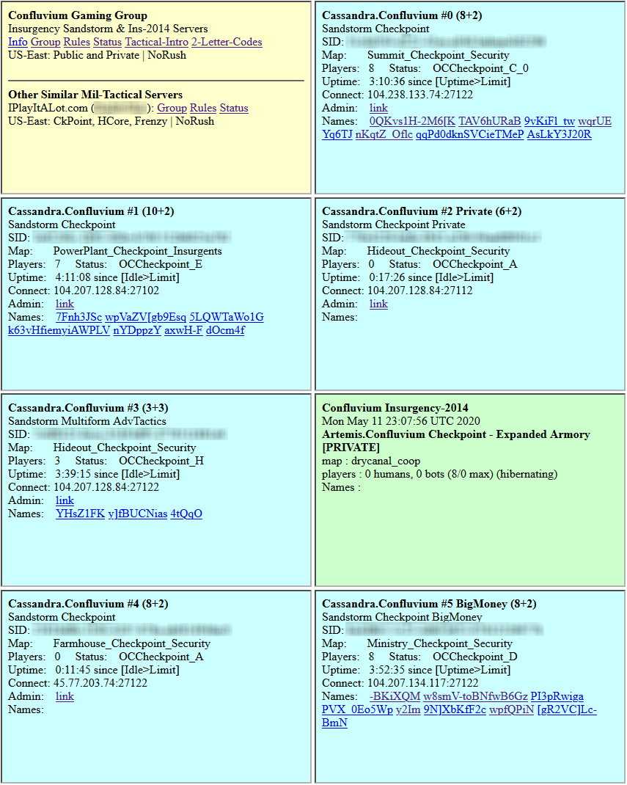
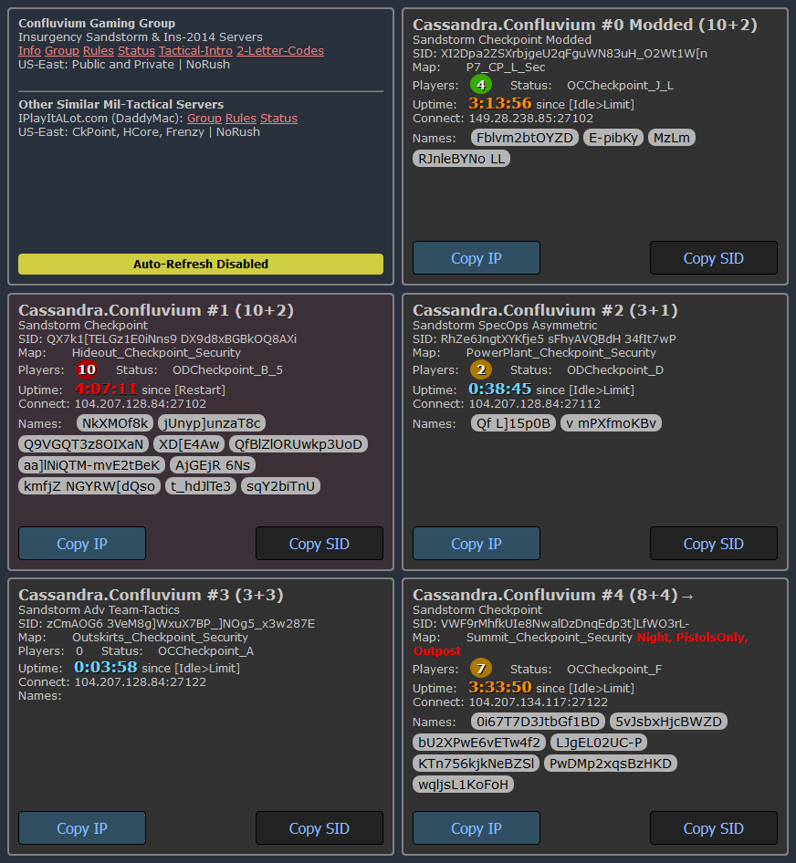

Google Chrome is currently unsupported due to its security implementation around iFrames. Neither the current copy text method or Clipboard API will work.

### Purpose
This script uses the [Tampermonkey](https://addons.mozilla.org/en-US/firefox/addon/tampermonkey/) extension to add quality-of-life features to the Insurgency: Sandstorm tactical community website [Confluvium Gaming](http://cassandra.confluvium.net/). Because the design of the website can easily and unintentionally cause a user to copy trailing whitespace, in addition to unsupported whitespace trimming in the game client, the user requires a perfect IP address copied to the clipboard when connecting via IP. Although this script began as a simple button to copy the IP address, many other features were developed.

### Feature Summary
* Copy IP button
* Copy SID button
* Dark theme
* More readable Steam names
* More readable server restart timers and server occupancy labels
* Custom font styling
* View additional server info

### Default Features
* A single-click button to copy IP address without the trailing whitespace
* A single-click button to copy SID (replay ID) without the trailing whitespace
* Dark mode
* Gray, pill-styled names to easily distinguish each player
* Prevents confusion around names with spaces that may look like a separate player on the next line if it renders at the end of the line
* More readable server occupancy and uptime labels
* Because there is certain server information that is not displayed, a separate source is retrieved to show if a server was manually changed by a moderator/admin to a non-checkpoint mode (e.g. Outpost), mutators (shotguns or pistols only), or a night map.
* Number of players in server will turn orange if there is only one slot available (9 / 10+2) or red if the server is full (10 / 10+2). If the configuration is set to moderator, then the script will account for that, too (orange: 11 / 10+2, red: 12 / 10+2).
* The server uptime will remain light blue until it turns orange on hour 3. It will remain orange until it turns red on hour 4. Then it will add a black background at 4h45m to complement the red font. Time above 4h45m is considered overtime and will attempt to restart if active players end the round on a success.
* Customize font size and family for server info or Steam names
* Page refresh countdown bar + countdown timer
* Differentiate a favorite server from the regular servers with a separate background color
* (2020-11-08: Deprecated) HTML encoding is not set by default and uses windows-1252 which may be the cause of garbled text. Player names with garbled text can be replaced with the correct text/symbols by adding the garbled text and associated text/symbol to the dictionary.
* Disable automatic page refresh (Can help you report a player before the auto-refresh removes them from the page)
* (Deprecated) Manually override a server IP with the new one in the event the owner has not updated the web interface
* Increase iFrame height to remove scrollbars
* (For developer use) Censor mode to take screenshots
* Customize a background color for highlighted players

### The Original Inconvenience Problem
Without this script, a user can double-click and drag the IP address at the website and press CTRL+C to copy the IP address, but this also copies trailing whitespace. The alternative is to carefully single-click and drag the IP address and stop precisely before the trailing white space. Both scenarios require increased hand-eye coordination and takes about 5 and 8 user actions, respectively, compared to 2 with this script enabled.

* Scenario #1: Without script, requires more hand-eye coordination for precise selection
  * 1. Hold mouse down
  * 2. Drag
  * 3. Mouse up
  * 4. Press CTRL
  * 5. Press C
  
* Scenario #2: Without script, requires additional actions (excludes same actions with script)
  * 1. Mouse down
  * 2. Mouse up
  * 3. Hold mouse down
  * 4. Drag
  * 5. Mouse up
  * 6. Press CTRL
  * 7. Press C
  * 8. Backspace
  
* Scenario #3: With script
  * 1. Mouse down
  * 2. Mouse up

### Notes
There is no ID or class selector asssociated with the IP address (or any value) in its HTML, which requires splitting the contents of the iFrame by ` ` and isolating the IP address. Alternatively, selecting the first instance of an IP address with Regex should work, too. The Clipboard API does not work, so the workaround requires creating an hidden input field to simulate a user select and user copy action.

## Before Site Helper

## After Site Helper using the Dark Theme

